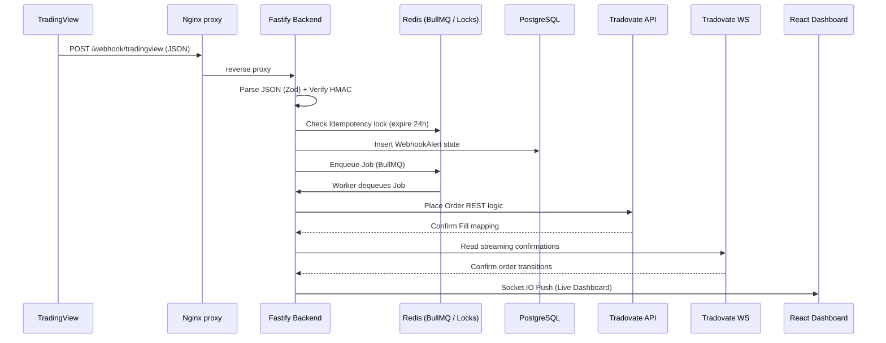

# Tradovate Webhook Bridge & Trade Dashboard

A production-ready webhook ingestion engine intercepting TradingView alerts, bridging to the Tradovate REST API via a robust Redis queue, and serving real-time performance analytics via an Exaggerated Minimalist React Dashboard.

## Architecture



## Quick Start (Local Docker)

1. Clone repo and create an environment scope:
```bash
cp .env.example .env
```
2. Bring up the data layer:
```bash
docker-compose up -d postgres redis
```
3. Boot the application stack:
```bash
docker-compose up -d app-backend app-frontend nginx
```

Access the minimal UI at `http://localhost/`.

## Feature List
- 🚀 **High Throughput Ingestion:** Fastify + Zod validator blocks junk
- 🔄 **Idempotent Queueing:** BullMQ execution blocks duplicate TV pings natively
- 🔒 **AES-256 Storage:** Appears plain text to apps internally, stored scrambled natively
- 📊 **Equity Calendar Heatmap:** react-big-calendar execution displays profitability visual maps.

See `docs/` for thorough integrations standards.
